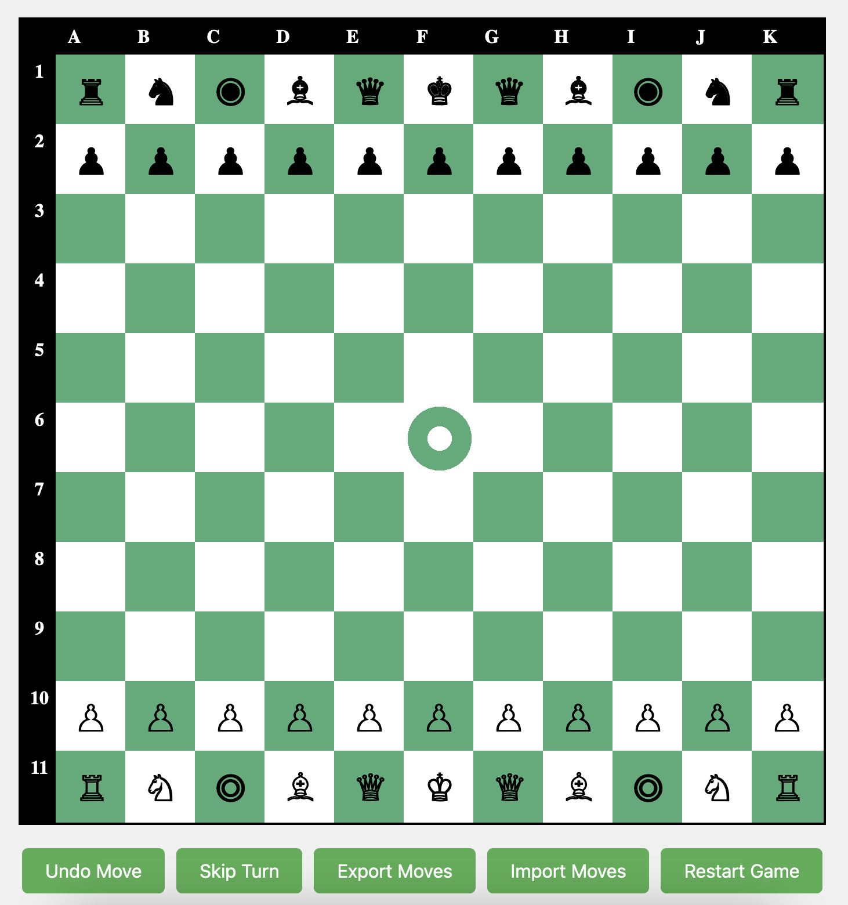

# Operation BattleGrid: Strategic Frontiers

Command elite units on an 11x11 grid where chess meets modern warfare. Master advanced tactics, exploit unique unit abilities, and shape your path to victory or defeat in this thrilling strategic challenge. Are you ready to conquer the strategic frontiers?

## Demo

Game units and rules: <https://lordghostx.github.io/battlegrid/#game-units>

Live preview: <https://lordghostx.github.io/battlegrid/demo/>



## Functionality

- **Undo Move**: Reverts the last move(s) made by any player
- **Export Moves**: Generates a custom [PGN format](https://en.wikipedia.org/wiki/Portable_Game_Notation) string representing the current gameplay
- **Import Moves**: Imports gameplay from a string provided by the **Export Moves** function
- **Restart Game**: Resets the entire gameplay. To preserve your progress, use the **Export Moves** function beforehand

## Game Units

#### Infantry (♙ ♟)

- Modeled after chess pawns
- Can advance 1 or 2 squares forward on each move, unlike chess pawns with fixed subsequent moves
- Executes diagonal captures, reaching up to 2 squares to eliminate enemy units

#### Tank (♖ ♜)

- Modeled after chess rooks
- Can advance and capture both vertically and horizontally without step limitations

#### Ghost (♘ ♞)

- Modeled after chess knights
- Can advance and capture in the classic 2+1 L-shape or an extended 3+1 L-shape pattern

#### Echo (◎ ◉)

- Newly introduced piece, taking inspiration from a mini-queen (princess)
- Can advance and capture two squares in any direction (vertical, horizontal, diagonal), with a fixed range of 2 squares

#### Drone (♗ ♝)

- Modeled after chess bishops
- Can advance and capture diagonally without step limitations
- Can also advance in any direction but limited to a single square
- Cannot capture except only diagonally

#### Peacekeeper (♕ ♛)

- Modeled after chess queens
- Can advance and capture in any direction without step limitations

#### Command Center (♔ ♚)

- Modeled after chess kings
- Can advance and capture in any direction but limited to a single square at a time
- The game concludes when this unit is captured or checkmated

## Game Rules

- Players have the option to skip their turn if they choose to do so
- The game is won by any player whose **Command Center (♔ ♚)** reaches the hill located at block F6
- The game can be concluded either by capturing or checkmating the opponent's **Command Center (♔ ♚)**
- There is no preference for which team plays first; it can be determined by mutual agreement or random selection
- Players are free to arrange their units in any formation, limited to the first three rows at the top and bottom of the board (excluded in this demo)

## Run Locally

```shell
# Clone the project
git clone https://github.com/LordGhostX/battlegrid

# Go to the project directory
cd battlegrid/demo

# Open the index.html file
[open/start] index.html
```

## Contributing

Contributions are always welcome!

If you have new features to introduce or bugs to squash, kindly submit a [Pull Request (PR)](https://github.com/LordGhostX/battlegrid/pulls) to make your mark. Your participation is highly appreciated.